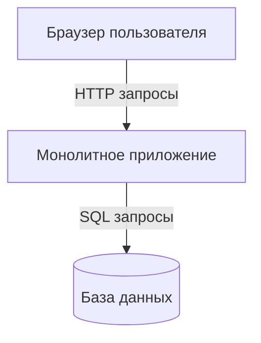
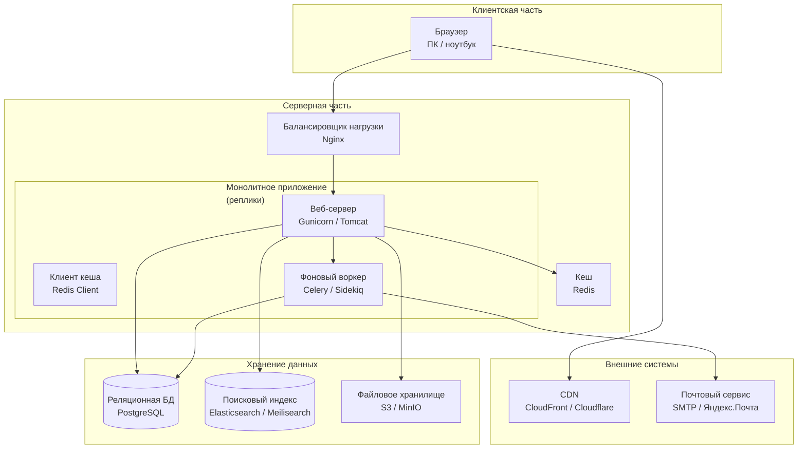

## Раздел 1
## 1. Выбранный архитектурный стиль - **Монолит**

## 2. Верхнеуровневая схема системы

**Пояснение к схеме:**
- **Клиент** — браузер пользователя (ПК или ноутбук)
- **Сервер** — монолитное приложение, которое содержит всю бизнес-логику, веб-интерфейс и слой работы с БД
- **База данных** — реляционная СУБД (PostgreSQL/MySQL)
- **Взаимодействие** — браузер отправляет HTTP-запросы, монолит обрабатывает их, при необходимости обращается к БД и возвращает готовую HTML-страницу

## 3. Обоснование выбора

### Почему монолит подходит для задачи (магазин автозапчастей)

1. **Целостность бизнес-логики** — каталог, корзина, заказы, поиск по артикулам тесно связаны. В монолите легко реализовать транзакции (например, уменьшить остаток на складе при оформлении заказа) без проблем распределённых систем.

2. **Ограниченные ресурсы** — проект под силу одного разработчика. В монолите проще дебажить, деплоить и тестировать.

3. **Предсказуемая нагрузка** — магазин автозапчастей не имеет резких пиков трафика (в отличие от соцсетей или билетных сервисов). Один экземпляр приложения выдерживает сотни и тысячи запросов в секунду.

4. **Быстрый старт** — не нужно проектировать API, очереди, сервис-дискавери. Достаточно классического фреймворка (Django, Laravel, Spring Boot) с шаблонизатором.

### Почему отказались от альтернатив (на примере микросервисов)

**Микросервисы отвергнуты, так как это чистый оверинжиниринг для данной задачи.**

Причины отказа:
- **Сложность координации** — оформление заказа требует согласованных изменений в каталоге, остатках и корзине. В микросервисной архитектуре пришлось бы внедрять паттерн Saga или двухфазный коммит, что резко повышает порог входа.
- **Команда не справится** — DevOps-нагрузка (CI/CD для 4–5 сервисов, мониторинг, трассировка, контейнеризация) неоправданно высока для магазина автозапчастей.
- **Скорость разработки** — в монолите изменить цену или добавить фильтр можно за часы. В микросервисах требуются договоры между сервисами, версионирование API, дополнительные обёртки.

### Минусы выбранного стиля и как планируется с ними жить

| Минус | Решение |
|-------|---------|
| При росте кода становится тесно | Чёткое модульное деление внутри монолита (папки/пакеты по фичам: `catalog`, `cart`, `orders`) |
| Масштабирование только вертикальное (более мощный сервер) | При достижении предела — горизонтальное масштабирование через реплики монолита + балансировщик |
| Ошибка в одном модуле валит весь магазин | Graceful shutdown, мониторинг (Sentry, New Relic), покрытие критических путей тестами |
| Привязка к одному языку/стеку | Изначально выбирается универсальный стек (Python/Java/Go), покрывающий бизнес-логику на годы вперёд |

## 4. Условия перехода на другие архитектуры (для монолита)

### Переход на клиент-серверную архитектуру

Произойдёт, если:
- Появляется **мобильное приложение** для удобного поиска запчастей
- Или требуется **публичное API** для интеграции с автосервисами и поставщиками

### Переход на микросервисы

Только при одновременном выполнении трёх условий:
1. **Команда разработки > 8 человек** (две и более команд не могут комфортно работать в одном монолите)
2. **Асимметричная нагрузка** (например, каталог читается 2000 раз/с, а оформление заказа — 50 раз/с, нужно масштабировать их независимо)
3. **Сбои в одном модуле не должны валить весь магазин** (например, упал платёжный шлюз, но поиск запчастей должен работать)

