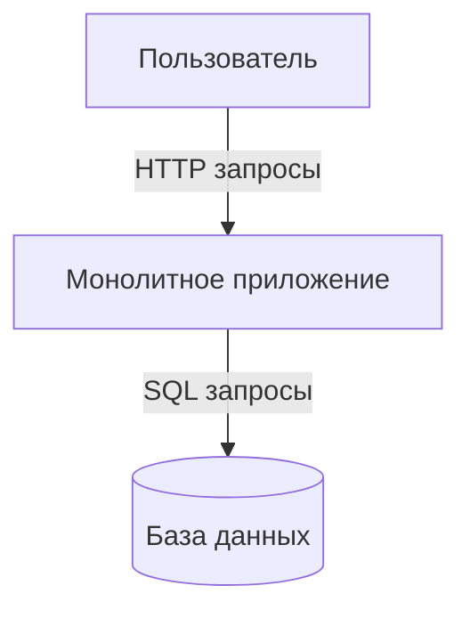
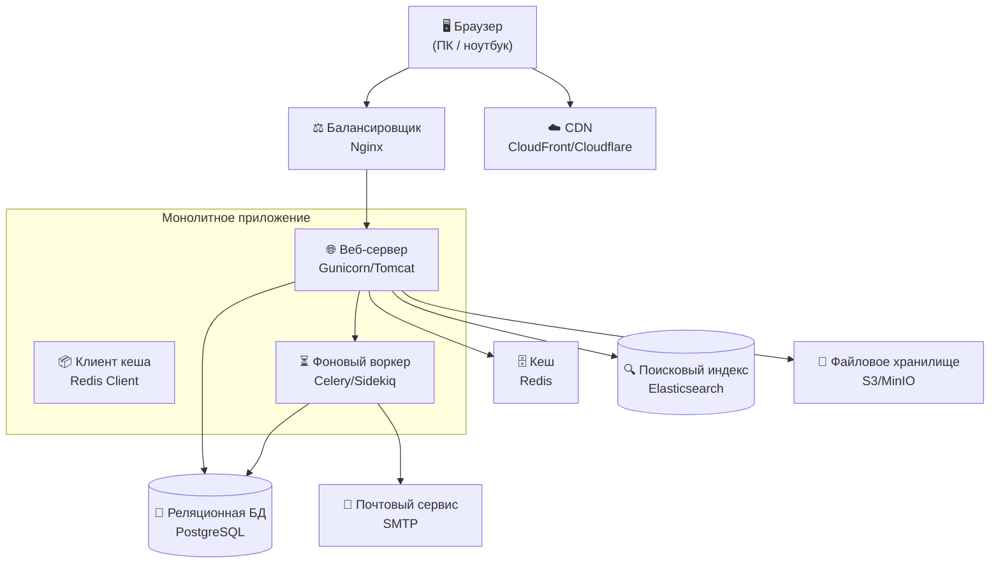
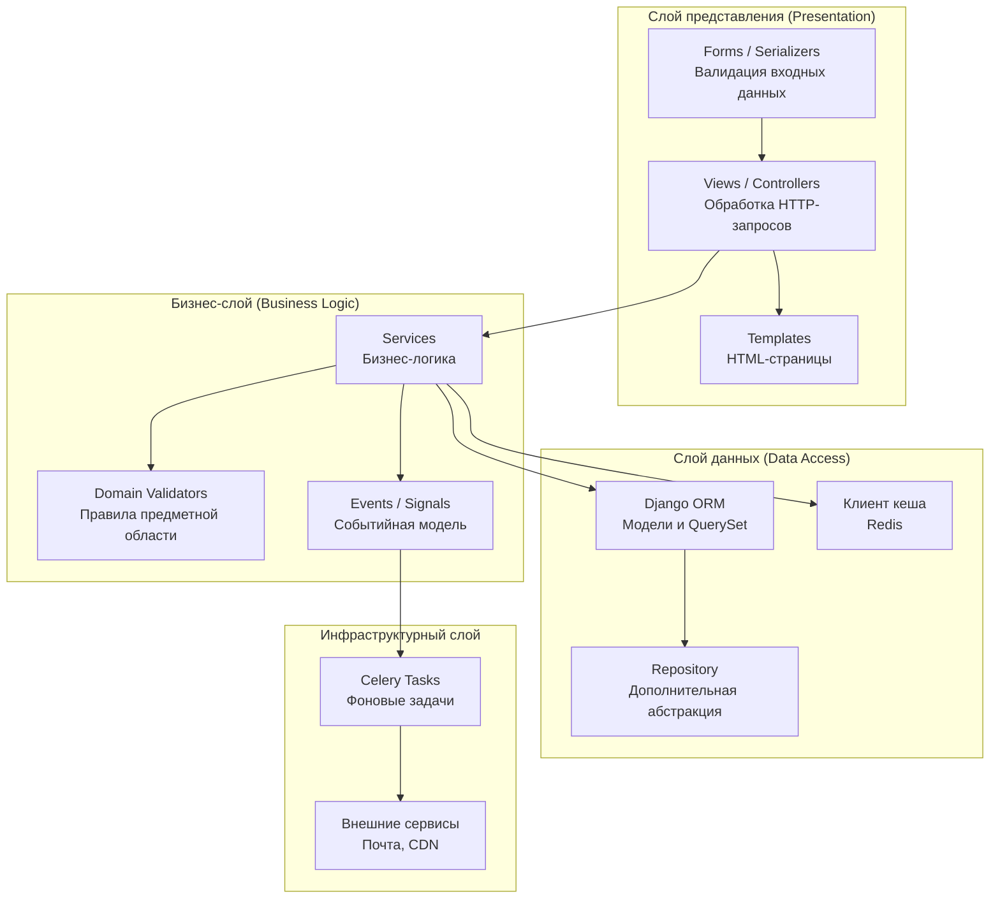
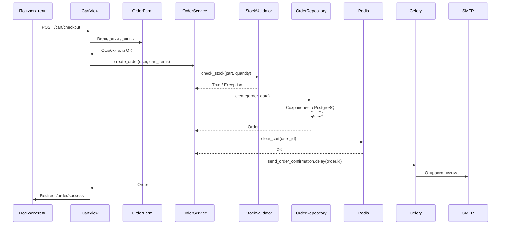

## Раздел 1
## 1. Выбранный архитектурный стиль - **Монолит**


## 2. Верхнеуровневая схема системы



**Пояснение к схеме:**
- **Клиент** — браузер пользователя (ПК или ноутбук)
- **Сервер** — монолитное приложение, которое содержит всю бизнес-логику, веб-интерфейс и слой работы с БД
- **База данных** — реляционная СУБД (PostgreSQL/MySQL)
- **Взаимодействие** — браузер отправляет HTTP-запросы, монолит обрабатывает их, при необходимости обращается к БД и возвращает готовую HTML-страницу


## 3. Обоснование выбора

### Почему монолит подходит для задачи (магазин автозапчастей)

1. **Целостность бизнес-логики** — каталог, корзина, заказы, поиск по артикулам тесно связаны. В монолите легко реализовать транзакции (например, уменьшить остаток на складе при оформлении заказа) без проблем распределённых систем.

2. **Ограниченные ресурсы** — проект под силу одного разработчика. В монолите проще дебажить, деплоить и тестировать.

3. **Предсказуемая нагрузка** — магазин автозапчастей не имеет резких пиков трафика (в отличие от соцсетей или билетных сервисов). Один экземпляр приложения выдерживает сотни и тысячи запросов в секунду.

4. **Быстрый старт** — не нужно проектировать API, очереди, сервис-дискавери. Достаточно классического фреймворка (Django, Laravel, Spring Boot) с шаблонизатором.

### Почему отказались от альтернатив (на примере микросервисов)

**Микросервисы отвергнуты, так как это чистый оверинжиниринг для данной задачи.**

Причины отказа:
- **Сложность координации** — оформление заказа требует согласованных изменений в каталоге, остатках и корзине. В микросервисной архитектуре пришлось бы внедрять паттерн Saga или двухфазный коммит, что резко повышает порог входа.
- **Команда не справится** — DevOps-нагрузка (CI/CD для 4–5 сервисов, мониторинг, трассировка, контейнеризация) неоправданно высока для магазина автозапчастей.
- **Скорость разработки** — в монолите изменить цену или добавить фильтр можно за часы. В микросервисах требуются договоры между сервисами, версионирование API, дополнительные обёртки.

### Минусы выбранного стиля и как планируется с ними жить

| Минус | Решение |
|-------|---------|
| При росте кода становится тесно | Чёткое модульное деление внутри монолита (папки/пакеты по фичам: `catalog`, `cart`, `orders`) |
| Масштабирование только вертикальное (более мощный сервер) | При достижении предела — горизонтальное масштабирование через реплики монолита + балансировщик |
| Ошибка в одном модуле валит весь магазин | Graceful shutdown, мониторинг (Sentry, New Relic), покрытие критических путей тестами |
| Привязка к одному языку/стеку | Изначально выбирается универсальный стек (Python/Java/Go), покрывающий бизнес-логику на годы вперёд |


## 4. Условия перехода на другие архитектуры (для монолита)

### Переход на клиент-серверную архитектуру

Произойдёт, если:
- Появляется **мобильное приложение** для удобного поиска запчастей
- Или требуется **публичное API** для интеграции с автосервисами и поставщиками

### Переход на микросервисы

Только при одновременном выполнении трёх условий:
1. **Команда разработки > 8 человек** (две и более команд не могут комфортно работать в одном монолите)
2. **Асимметричная нагрузка** (например, каталог читается 2000 раз/с, а оформление заказа — 50 раз/с, нужно масштабировать их независимо)
3. **Сбои в одном модуле не должны валить весь магазин** (например, упал платёжный шлюз, но поиск запчастей должен работать)


## Раздел 2 — Компоненты системы


### 2.2 Описание компонентов

#### Клиентская часть

| Компонент | Что делает | Зачем нужен именно магазину автозапчастей |
|-----------|------------|-------------------------------------------|
| **Браузер (ПК)** | Отображает каталог автозапчастей, обрабатывает ввод пользователя (поиск по артикулу, фильтры по авто), отправляет HTTP-запросы | Основной канал продаж. Водители и механики ищут запчасти с ПК или ноутбука в гараже или офисе |


#### Серверная часть

| Компонент | Что делает | Зачем нужен именно магазину автозапчастей |
|-----------|------------|-------------------------------------------|
| **Балансировщик нагрузки (Nginx)** | Распределяет входящие HTTP-запросы между несколькими репликами монолита, отдаёт статику | Одна копия приложения не выдержит час пик (вечер пятницы — все чинят машины перед выходными). Nginx размажет нагрузку и не даст системе упасть |
| **Веб-сервер (Gunicorn / Tomcat)** | Выполняет бизнес-логику: поиск по каталогу, добавление в корзину, расчёт цены, оформление заказа | Сердце системы. Именно он знает, что артикул `2101-1000100` — это "Блок цилиндров ВАЗ 2101" и стоит 15000 ₽ |
| **Клиент кеша (Redis Client)** | Ходит в Redis за часто запрашиваемыми данными вместо тяжёлых SQL-запросов | Без кеша каждый поиск "масляный фильтр" будет делать полное сканирование таблицы на миллионе запчастей. Сервер упадёт от нагрузки |
| **Фоновый воркер (Celery / Sidekiq)** | Уводит долгие задачи в фон: отправка писем с подтверждением, генерация каталога для печати, обновление остатков от поставщика | Пользователь не должен ждать 10 секунд, пока магазин отправит письмо или обновит 5000 остатков. Воркер делает это незаметно |

#### Хранение данных

| Компонент | Что делает | Зачем нужен именно магазину автозапчастей |
|-----------|------------|-------------------------------------------|
| **Реляционная БД (PostgreSQL)** | Хранит: каталог запчастей (артикул, цена, остаток), заказы, клиентов, скидки, поставщиков | Деньги и заказы должны быть в ACID-транзакциях. Нельзя, чтобы запчасть ушла в заказ, но со склада не списалась. Реляционная БД гарантирует целостность |
| **Поисковый индекс (Elasticsearch / Meilisearch)** | Быстрый полнотекстовый поиск по названиям, артикулам, брендам, совместимости с авто | Поиск по запросу "крыло логан правое" должен работать за 50 мс, а не 2 секунды. PostgreSQL с оператором `LIKE '%...%'` умрёт при 1000 одновременных поисках |
| **Файловое хранилище (S3 / MinIO)** | Хранит фотографии запчастей (по 3–5 фото на каждую), каталоги в PDF, чеки | В магазине автозапчастей **картинка решает**: клиент не купит деталь, если не видит её состояние. Хранить фото в БД — плохая практика (занимает много места и тормозит систему) |

#### Кеш (Redis)

**Что именно кешируется:**

1. **Категории и фильтры** — дерево категорий ("Двигатель / Трансмиссия / Тормозная система"), список марок и моделей автомобилей
2. **Топ-100 популярных запчастей** — масляные фильтры, ремни ГРМ, тормозные колодки (их ищут 80% пользователей)
3. **Сессии пользователей** — содержимое корзины неавторизованного клиента
4. **Результаты поиска** — одинаковый запрос "фильтр масляный toyota" может повторяться сотни раз в час

**Почему без кеша плохо:**

- База данных магазина содержит **500 000+ записей** (популярные бренды + редкие детали под заказ)
- Каждый поиск без кеша = тяжёлый SQL-запрос = нагрузка на диск и процессор
- В час пик (пятница, 18:00–20:00) БД может не выдержать 2000+ одновременных покупателей
- Без кеша поиск будет тормозить → клиенты уйдут к конкурентам (Exist.ru, Emex)

#### CDN — Content Delivery Network

| Компонент | Что делает | Зачем нужен именно магазину автозапчастей |
|-----------|------------|-------------------------------------------|
| **CDN (CloudFront / Cloudflare)** | Раздаёт статику и фотографии запчастей из ближайшего к клиенту географического узла | Фотография запчасти весит 500–1500 КБ. Без CDN каждый покупатель грузит фото с сервера в Москве — клиент во Владивостоке будет ждать 3 секунды. С CDN фото летит с сервера в Хабаровске за 200 мс |

**Что раздаётся через CDN:**
- Фотографии запчастей (основные и детальные)
- CSS, JS, шрифты
- PDF-каталоги и инструкции

### 2.3 Сводная таблица всех компонентов

| Компонент | Тип | Обязательность | Основная причина использования |
|-----------|-----|----------------|--------------------------------|
| Браузер | Клиент | ✅ Обязателен | Интерфейс для покупателей |
| Nginx | Балансировщик | ✅ Обязателен | Распределение нагрузки в час пик |
| Gunicorn / Tomcat | Веб-сервер | ✅ Обязателен | Выполнение бизнес-логики магазина |
| Redis | Кеш | ✅ Обязателен | Ускорение поиска, хранение корзин |
| Celery / Sidekiq | Фоновый воркер | ✅ Обязателен | Асинхронные задачи (письма, обновления) |
| PostgreSQL | База данных | ✅ Обязателен | Основное хранилище с поддержкой ACID |
| Elasticsearch / Meilisearch | Поисковый движок | ✅ Обязателен | Быстрый поиск по 500 000+ запчастей |
| S3 / MinIO | Файловое хранилище | ✅ Обязателен | Хранение фотографий запчастей |
| CDN | Доставка контента | ✅ Обязателен | Ускорение загрузки фото по всей России |
| SMTP | Почтовый сервис | ✅ Обязателен | Подтверждение заказов, уведомления |

## Раздел 3 — Оценка нагрузки

### 3.1 Вводные данные

Магазин автозапчастей — нишевой B2C-сервис. Аудитория — владельцы автомобилей и мелкие СТО.

| Параметр | Значение | Обоснование |
|----------|----------|-------------|
| Целевая аудитория | Автовладельцы + СТО | В России ~60 млн автомобилей |
| Потенциальных клиентов | 500 000 | Те, кто ищет запчасти онлайн |
| **DAU (реалистично)** | **10 000** | 2% от потенциальной аудитории в первый год работы |

---

### 3.2 Действия пользователя за день

| Действие | Кол-во раз в день | Кто делает |
|----------|-------------------|-------------|
| Поиск по каталогу | 5 раз | Все пользователи |
| Просмотр карточки товара | 10 раз | Все пользователи |
| Фильтрация / сортировка | 3 раза | Все пользователи |
| Добавление в корзину | 2 раза | 30% пользователей |
| Оформление заказа | 1 раз | 10% пользователей |
| Авторизация | 1 раз | 20% пользователей |

---

### 3.3 Расчёт RPS (Requests Per Second)

#### Базовые формулы

```
Запросов в сутки = DAU × (сумма действий × долю пользователей)
Запросов в секунду (средний) = Запросов в сутки / (24 × 3600)
Запросов в секунду (пиковый) = Средний × 3
```

#### Расчёт по каждому действию

| Действие | DAU | % | Кол-во | Итого запросов/сутки |
|----------|-----|---|--------|---------------------|
| Поиск по каталогу | 10 000 | 100% | 5 | 10 000 × 1,0 × 5 = 50 000 |
| Просмотр карточки | 10 000 | 100% | 10 | 10 000 × 1,0 × 10 = 100 000 |
| Фильтрация | 10 000 | 100% | 3 | 10 000 × 1,0 × 3 = 30 000 |
| Добавление в корзину | 10 000 | 30% | 2 | 10 000 × 0,3 × 2 = 6 000 |
| Оформление заказа | 10 000 | 10% | 1 | 10 000 × 0,1 × 1 = 1 000 |
| Авторизация | 10 000 | 20% | 1 | 10 000 × 0,2 × 1 = 2 000 |

#### Итого

```
Запросов в сутки = 50 000 + 100 000 + 30 000 + 6 000 + 1 000 + 2 000 = 189 000
```

#### Средний RPS

```
RPS(средний) = 189 000 / (24 × 3600) = 189 000 / 86 400 ≈ 2,2 RPS
```

#### Пиковый RPS

```
RPS(пиковый) = 2,2 × 3 ≈ 7 RPS
```

> **Важно:** Пик нагрузки приходится на вечер пятницы (18:00–21:00) и воскресенье (11:00–14:00), когда люди чинят машины перед рабочей неделей.

---

### 3.4 Расчёт нагрузки на БД

Действия, которые **реально ходят в базу данных** (не все запросы = RPS):

| Тип запроса | % от RPS | RPS | Пояснение |
|-------------|----------|-----|-----------|
| Чтение (SELECT) | 80% | 5,6 | Поиск, фильтры, карточки |
| Запись (INSERT/UPDATE) | 15% | 1,05 | Корзина, заказы, авторизация |
| Сложные аналитические | 5% | 0,35 | Отчёты, популярные запчасти |

```
Запросов к БД (средний) = 7 RPS (всего запросов)
Запросов к БД (пиковый) = 7 × 3 ≈ 21 RPS
```

> **Важно:** Кеш (Redis) заберёт на себя ~70% чтения. Реальная нагрузка на PostgreSQL:

```
Чтение с кешем = 5,6 × 0,3 ≈ 1,7 RPS (попадания в кеш пропускают БД)
Итого БД (средний) ≈ 1,7 + 1,05 + 0,35 ≈ 3,1 RPS
Итого БД (пиковый) ≈ 3,1 × 3 ≈ 9 RPS
```

---

### 3.5 Расчёт объёма данных

#### Данные за день

| Тип данных | За день | Пояснение |
|------------|---------|-----------|
| Заказы (новые) | 10 000 × 0,1 = 1000 заказов | 10% пользователей оформляют заказ |
| Запчастей в заказах | 1000 × 3 = 3000 позиций | В среднем 3 позиции на заказ |
| Новые пользователи | 200 регистраций | 2% от DAU |
| Логи действий | 189 000 × 0,5 КБ = 95 МБ | Логирование всех действий |
| Фото загруженных запчастей | 0 (пока нет загрузки от пользователей) | Только админ загружает фото |

#### Подробный расчёт

```
Размер одного заказа (JSON/строка) ≈ 1 КБ
Размер позиции заказа ≈ 0,5 КБ
Размер записи пользователя ≈ 2 КБ
Размер лога ≈ 0,5 КБ
```

| Параметр | Формула | Результат |
|----------|---------|-----------|
| Объём заказов за день | 1000 × 1 КБ = 1 МБ | 1 МБ |
| Объём позиций за день | 3000 × 0,5 КБ = 1,5 МБ | 1,5 МБ |
| Объём новых пользователей | 200 × 2 КБ = 0,4 МБ | 0,4 МБ |
| Объём логов за день | 189 000 × 0,5 КБ = 94 500 КБ | ~95 МБ |

```
Итого данных за день (без учёта фото) ≈ 1 + 1,5 + 0,4 + 95 ≈ 98 МБ
```

#### Данные за год

```
98 МБ × 365 дней ≈ 35,8 ГБ
```

> **Важно:** Это без учёта фотографий запчастей (их загружает администратор, а не пользователи).

#### Фотографии запчастей (данные от админа)

| Параметр | Значение |
|----------|----------|
| Количество запчастей в каталоге | 50 000 |
| Фотографий на запчасть | 3 |
| Размер одной фотографии | 1 МБ |
| Объём фото (не сжатый) | 50 000 × 3 × 1 МБ = 150 ГБ |
| Объём фото после оптимизации (WebP + CDN) | 150 × 0,3 = 45 ГБ |

```
Итого данных с фото за год ≈ 36 ГБ (база) + 45 ГБ (фото) ≈ 81 ГБ
```

---

### 3.6 Расчёт потребления ресурсов

#### Оперативная память (RAM)

| Компонент | Расход RAM | Пояснение |
|-----------|------------|-----------|
| Веб-сервер (Gunicorn/Tomcat) | 2 ГБ | 4 воркера × 512 МБ |
| PostgreSQL | 4 ГБ | Рекомендуется 25% от объёма БД |
| Redis | 2 ГБ | Кеш для популярных запросов |
| Elasticsearch | 4 ГБ | Поисковый индекс |
| Итого | **12 ГБ** | |

#### Процессор (CPU)

| Компонент | Ядер | Пояснение |
|-----------|------|-----------|
| Веб-сервер | 4 ядра | Обработка 7 RPS |
| PostgreSQL | 2 ядра | 3 RPS + индексы |
| Redis | 1 ядро | В основном память |
| Elasticsearch | 2 ядра | Поисковые запросы |
| Итого | **9 ядер** | |

> **Важно:** При RPS = 7 и 9 ядрах — **избыточность 30-50%**. Запас прочности есть.

---

### 3.7 Вывод: масштабирование

#### Может ли один сервер справиться?

| Параметр | Потребность | Обычный сердер (VPS) | Базовая машина (Dedicated) |
|----------|-------------|---------------------|---------------------------|
| CPU | 9 ядер | 4–8 ядер (VPS) | 8–16 ядер (Dedicated) |
| RAM | 12 ГБ | 8–16 ГБ (VPS) | 32–64 ГБ (Dedicated) |
| Диск | 81 ГБ/год | 200–400 ГБ SSD | 512 ГБ – 1 ТБ SSD |

**Результат:**

- **Обычный VPS (4–8 ядер, 8–16 ГБ RAM)** — справится, но на пределе
- **Базовая выделенная машина (8–16 ядер, 32 ГБ RAM)** — справится с запасом в 2–3 раза

#### Итоговый вывод

```

Текущая нагрузка:                                                 
• Средний RPS ≈ 2,2                                                
• Пиковый RPS ≈ 7                                                
• Запросов к БД ≈ 3 RPS                                           
• Объём данных ≈ 80 ГБ в первый год                                
                                                                
 Решение:                                                            
✅ ОДНОГО СЕРВЕРА ДОСТАТОЧНО прямо сейчас                         
• Один выделенный сервер (8–16 ядер, 32 ГБ RAM, 1 ТБ SSD)          
• Вертикальное масштабирование (увеличение мощности) покрывает    
рост в 5–10 раз                                                 
• Горизонтальное масштабирование НЕ НУЖНО до 50 000 DAU                                                                      
Порог перехода на горизонтальное масштабирование:                  
• RPS > 30 (3–4 кратный рост трафика)                              
• DAU > 50 000
• Или когда пиковый RPS перегружает 1 сервер (>80% CPU)           
```
### 3.8 Резюме

| Показатель | Значение |
|------------|----------|
| DAU (реалистичный) | 10 000 |
| RPS средний | 2,2 |
| RPS пиковый | 7 |
| Запросов к БД (средний) | 3 RPS |
| Данных за день | 98 МБ |
| Данных за год | 81 ГБ (с фото) |
| CPU потребность | 9 ядер |
| RAM потребность | 12 ГБ |

**Заключение:** Один сервер (8–16 ядер, 32 ГБ RAM, 1 ТБ SSD) полностью покрывает потребности магазина автозапчастей на 2–3 года работы без горизонтального масштабирования.

## Раздел 4 — Выбор стека технологий

### 4.1 Сводная таблица выбора

| Слой | Технология |
|------|-------------|
| Бэкенд (язык) | Python |
| Бэкенд (фреймворк) | Django |
| База данных | PostgreSQL |
| Поисковый движок | Meilisearch |
| Кеш | Redis |
| Фоновый воркер | Celery |
| Фронтенд | Django Templates + HTMX |
| Файловое хранилище | MinIO (self-hosted) → S3 |
| Веб-сервер | Gunicorn |
| Балансировщик | Nginx |
| CDN | Cloudflare |

---

### 4.2 Бэкенд

#### Язык: Python

| Параметр | Выбор |
|----------|-------|
| **Что выбрали** | Python 3.11+ | |
| **Почему подходит** | • Быстрая разработка — магазин автозапчастей требует частых обновлений каталога, цен, акций<br>• Огромный выбор библиотек для работы с автозапчастями: парсинг прайсов поставщиков (OpenPyXL для Excel), работа с VIN-номерами<br>• Лёгкий найм разработчиков для небольшой команды<br>• Подходит для монолита — код легко рефакторить и поддерживать |
| **Альтернатива** | Node.js (JavaScript/TypeScript) |
| **Почему отказались** | • Меньше библиотек для работы с Excel/XML-прайсами (основной источник данных от поставщиков)<br>• Коллбэки и асинхронность усложняют простые CRUD-операции каталога<br>• В России команду Python найти проще и дешевле |
---

#### Фреймворк: Django

| Параметр | Выбор |
|----------|-------|
| **Что выбрали** | Django 4.2+ | |
| **Почему подходит** | • **Готовая админка** — управление каталогом из 50 000 запчастей без написания лишнего кода. Админ загружает фото, меняет цены, управляет остатками<br>• **ORM** — безопасная работа с PostgreSQL, защита от SQL-инъекций (критично для заказов)<br>• **Миграции** — легко менять схему БД (добавили поле "совместимость с авто" — одна команда)<br>• **Аутентификация из коробки** — регистрация, корзина, история заказов<br>• **Формальная проверка заказов** — встроенные валидаторы форм |
| **Альтернатива** | Flask + SQLAlchemy + админка на заказ |
| **Почему отказались** | • Пришлось бы писать админку с нуля (20+ человеко-дней)<br>• Отсутствие готовой системы аутентификации и прав доступа<br>• Для магазина автозапчастей 80% логики — это CRUD каталога, который Django даёт "бесплатно" |

---

### 4.3 База данных

#### Тип: Реляционная (SQL)

| Параметр | Выбор |
|----------|-------|
| **Что выбрали** | PostgreSQL 15+ | |
| **Почему подходит** | • **ACID-транзакции** — при оформлении заказа нужно атомарно: проверить остаток → списать запчасть → создать заказ → уменьшить остаток. Нельзя потерять деньги<br>• **Связи между данными** — запчасть → категория → бренд → совместимость с авто (Foreign Keys)<br>• **Полнотекстовый поиск базовый** — можно искать по артикулу `2101-1000100` и названию "блок цилиндров" в одной таблице до роста нагрузки<br>• **JSONB-поля** — можно хранить характеристики запчасти (размеры, материал, вес) без создания 10 дополнительных таблиц |
| **Альтернатива** | MySQL |
| **Почему отказались** | • Лучшая поддержка JSONB для гибких характеристик запчастей<br>• PostgreSQL лучше справляется со сложными JOIN-запросами (каталог → категории → бренды → остатки)<br>• Более строгое соблюдение SQL-стандартов, меньше неожиданностей при миграциях |
--

### 4.4 Поисковый движок

| Параметр | Выбор |
|----------|-------|
| **Что выбрали** | Meilisearch | |
| **Почему подходит** | • **Поиск по опечаткам из коробки** — пользователь ищет `"фльтр масляный"` (опечатка) и всё равно находит запчасть. Для магазина автозапчастей критично<br>• **Поиск по части слова** — `"крыло"` находит `"крыло переднее правое"`<br>• **Ранжирование по популярности** — частозаказываемые запчасти поднимаются вверх<br>• **Мгновенный поиск** — ответ за <50 мс даже на 500 000 записей<br>• **Простота настройки** — не нужен DevOps-инженер как для Elasticsearch |
| **Альтернатива** | Elasticsearch |
| **Почему отказались** | • Слишком сложный для первой версии (кластеризация, настройка шардов)<br>• Требует больше ресурсов (Java, 4+ ГБ RAM)<br>• Для магазина автозапчастей не нужны сложные агрегации и аналитика, которыми славится Elasticsearch<br>• Meilisearch "из коробки" даёт то, что нужно для поиска запчастей |
---

### 4.5 Кеш (Redis)

| Параметр | Выбор |
|----------|-------|
| **Что выбрали** | Redis 7+ | |
| **Почему подходит** | • **Хранение корзины неавторизованного пользователя** — Redis подходит идеально: TTL на корзину 30 дней, структура хэшей для хранения артикулов и количеств<br>• **Кеш популярных запчастей** — топ-100 запчастей (масляные фильтры, ремни, колодки) хранятся в памяти. Доступ за <1 мс вместо 50 мс<br>• **Кеш категорий и фильтров** — дерево категорий редко меняется, его можно кешировать на день<br>• **Сессии пользователей** — Django поддерживает Redis как бэкенд для сессий "из коробки"<br>• **Счётчики** — сколько раз искали запчасть, можно хранить в Redis и периодически сбрасывать в БД |
| **Альтернатива** | Memcached |
| **Почему отказались** | • Нет встроенных структур данных (хэши, списки, множества) для корзины и счётчиков<br>• Нет персистентности — при перезапуске кеш полностью теряется<br>• Redis — стандарт де-факто для Django (django-redis) |

---

### 4.6 Фоновый воркер

| Параметр | Выбор |
|----------|-------|
| **Что выбрали** | Celery | |
| **Почему подходит** | • **Отправка писем** — после оформления заказа пользователь не ждёт 2 секунды, пока письмо уйдёт. Задача уходит в фон<br>• **Обновление остатков от поставщиков** — раз в час загружается прайс из Excel на 50 000 позиций. Воркер делает это без блокировки основного приложения<br>• **Генерация каталогов PDF** — формирование файла на 100 страниц занимает минуту. Пользователь нажимает "скачать" и получает ссылку на почту через 5 минут<br>• **Очистка корзин** — раз в сутки удалять корзины старше 30 дней<br>• **Интеграция с Django** — celery-django работает без дополнительных костылей |
| **Альтернатива** | RQ (Redis Queue) |
| **Почему отказались** | • RQ проще, но меньше возможностей (сложные цепочки задач, планирование, повторы при ошибках)<br>• Нет мониторинга из коробки (Celery имеет Flower для наблюдения)<br>• При росте сложности задач (обновление остатков от 5 поставщиков с разными форматами) Celery справится, а RQ — нет |

---

### 4.7 Фронтенд

| Параметр | Выбор |
|----------|-------|
| **Что выбрали** | Django Templates + HTMX | |
| **Почему подходит** | • **Быстрая разработка** — не нужен отдельный фронтенд-разработчик. Один Python-разработчик делает всё<br>• **SEO из коробки** — поисковики видят готовый HTML. Для магазина автозапчастей это важно (люди ищут "крыло ваз 2101 купить")<br>• **Динамика без перезагрузки** — HTMX позволяет добавлять корзину, обновлять корзину, фильтры без полной перезагрузки страницы<br>• **Простота** — никакой сборки Webpack, Node.js, npm |
| **Альтернатива** | React/Vue + REST API |
| **Почему отказались** | • Нужен отдельный фронтенд-разработчик (или больше времени от бэкендера)<br>• SEO требует SSR (Next.js/Nuxt), что усложняет архитектуру<br>• Оверинжиниринг для магазина автозапчастей — здесь не нужна сложная клиентская логика<br>• Двойная работа: писать API и фронт под него |


---

### 4.8 Файловое хранилище

| Параметр | Выбор |
|----------|-------|
| **Что выбрали** | MinIO (self-hosted) → в будущем S3 (AWS/Selectel) | |
| **Почему подходит** | • **Хранение фотографий запчастей** — 45 ГБ фото на старте. Минимальные затраты на диски<br>• **S3-совместимое API** — легко перейти на облачное S3 при росте<br>• **Интеграция с Django** — django-storages поддерживает и MinIO, и S3<br>• **Контроль над данными** — на старте не хочется платить за облако, свой MinIO на том же сервере — дёшево |
| **Альтернатива** | Хранение фото в БД (PostgreSQL BYTEA) |
| **Почему отказались** | • БД раздуется до 50+ ГБ, тормозят запросы даже при SELECT без фото<br>• Бэкапы БД станут огромными и медленными<br>• Нельзя отдавать фото через CDN — каждый запрос идёт через Django |

---

### 4.9 Веб-сервер и балансировщик

| Параметр | Выбор |
|----------|-------|
| **Что выбрали** | Gunicorn + Nginx | |
| **Почему подходит** | • **Gunicorn** — стандартный WSGI-сервер для Django. Умеет работать с несколькими воркерами (4–8 штук)<br>• **Nginx** — отдаёт статику (CSS, JS, фото из MinIO, если нет CDN), проксирует запросы к Gunicorn, балансирует нагрузку<br>• **Готовые конфигурации** — типовой связка для Django |
| **Альтернатива** | uWSGI |
| **Почему отказались** | • Сложнее в настройке (конфигурация не такая понятная, как у Gunicorn)<br>• Больше потребляет памяти на воркер |

---

### 4.10 CDN

| Параметр | Выбор |
|----------|-------|
| **Что выбрали** | Cloudflare (бесплатный тариф) | |
| **Почему подходит** | • **Бесплатно на старте** — для 45 ГБ фото и 10 000 DAU хватает<br>• **Глобальная сеть** — у Cloudflare 200+ точек присутствия, включая Россию<br>• **Защита от DDoS** — магазин автозапчастей — цель для атак конкурентов<br>• **Простота подключения** — просто меняется NS-сервер или настраивается прокси |
| **Альтернатива** | Amazon CloudFront |
| **Почему отказались** | • Платная (первые ГБ бесплатно, потом платно)<br>• Сложнее настройка (нужен AWS-аккаунт, IAM-роли, S3 Bucket Policy)<br>• Нет бесплатной защиты от DDoS |


### 4.11 Итоговая таблица с обоснованием

| Технология | Почему именно она | От чего отказались |
|------------|-------------------|---------------------|
| Python | Быстрая разработка, Excel-библиотеки, лёгкий найм | Go (медленно), Node.js (меньше библиотек) |
| Django | Готовая админка, ORM, миграции, аутентификация | Flask (всё писать с нуля) |
| PostgreSQL | ACID, связи, JSONB, транзакции для заказов | MySQL (хуже JSONB), MongoDB (нет транзакций) |
| Meilisearch | Поиск по опечаткам, простота, скорость | Elasticsearch (сложно), pg_trgm (медленно) |
| Redis | Корзина, кеш, сессии, счётчики | Memcached (нет хэшей и персистентности) |
| Celery | Письма, обновление прайсов, PDF | RQ (меньше возможностей) |
| Django + HTMX | SEO, динамика без перезагрузки, 1 разработчик | React (оверинжиниринг) |
| MinIO → S3 | Фото запчастей, централизованное хранилище | Файловая система (нет репликации), БД (раздувается) |
| Gunicorn + Nginx | Стандарт для Django, простота | uWSGI (сложнее) |
| Cloudflare | Бесплатно, DDoS-защита, глобальная сеть | CloudFront (дорого, сложно) |

## Раздел 5 — Архитектура кода

### 5.1 Общая схема слоёв бэкенда



---

### 5.2 Слои архитектуры (описание)

#### 5.2.1 Слой представления (Presentation Layer)

Отвечает за взаимодействие с пользователем и внешними системами.

| Компонент | Что делает | Пример в магазине автозапчастей |
|-----------|------------|--------------------------------|
| **Views** | Принимает HTTP-запросы, вызывает нужные сервисы, возвращает ответ | `catalog_view` — поиск по артикулу, `cart_view` — добавление в корзину |
| **Forms** | Валидирует данные от пользователя | `OrderForm` — проверка телефона, адреса, наличия запчастей |
| **Templates** | Генерирует HTML-страницы | `catalog.html` — список запчастей с фильтрами |

**Пример кода (концептуально):**

```python
# views/catalog.py
class CatalogView(View):
    def get(self, request):
        form = SearchForm(request.GET)
        if form.is_valid():
            parts = catalog_service.search(
                query=form.cleaned_data['q'],
                brand=form.cleaned_data['brand']
            )
        return render(request, 'catalog.html', {'parts': parts})
```

---

#### 5.2.2 Бизнес-слой (Business Logic Layer)

Сердце системы — вся логика предметной области.

| Компонент | Что делает | Пример в магазине автозапчастей |
|-----------|------------|--------------------------------|
| **Services** | Оркестрирует операции, координирует репозитории и валидаторы | `CartService` — расчёт стоимости корзины со скидками<br>`OrderService` — оформление заказа, проверка остатков<br>`CatalogService` — поиск с учётом совместимости |
| **Domain Validators** | Проверяет бизнес-правила | `StockValidator` — достаточно ли запчастей на складе<br>`CompatibilityValidator` — подходит ли запчасть к авто |
| **Events** | Генерирует события для асинхронной обработки | `OrderCreatedEvent` → запускает отправку письма и очистку корзины |

**Пример кода (концептуально):**

```python
# services/order.py
class OrderService:
    def create_order(self, user, cart_items):
        # 1. Проверка бизнес-правил
        for item in cart_items:
            if not stock_validator.check(item.part, item.quantity):
                raise NotEnoughStockError(item.part)
        
        # 2. Расчёт стоимости
        total = price_calculator.calculate(cart_items, user.discount)
        
        # 3. Создание заказа
        order = Order.objects.create(user=user, total=total, items=cart_items)
        
        # 4. Генерация события
        event_dispatcher.dispatch(OrderCreatedEvent(order))
        
        return order
```

---

#### 5.2.3 Слой данных (Data Access Layer)

Отвечает за хранение и извлечение данных.

| Компонент | Что делает | Пример в магазине автозапчастей |
|-----------|------------|--------------------------------|
| **ORM Models** | Описывает структуру таблиц и связи | `Part` (артикул, цена, остаток)<br>`Order` (пользователь, дата, сумма)<br>`OrderItem` (запчасть, количество) |
| **Repository** | Абстракция над ORM для сложных запросов | `PartRepository` — поиск с пагинацией и фильтрацией<br>`OrderRepository` — выборка заказов за период |
| **Cache Client** | Работа с Redis | `CacheService` — кеширование топ-100 запчастей, корзины пользователя |

**Пример кода (концептуально):**

```python
# repositories/part.py
class PartRepository:
    def search_with_filters(self, query, brand, category, page):
        # Сначала пытаемся взять из кеша
        cache_key = f"search:{query}:{brand}:{category}:{page}"
        cached = cache_service.get(cache_key)
        if cached:
            return cached
        
        # Сложный запрос через ORM
        qs = Part.objects.select_related('brand', 'category')
        if query:
            qs = qs.filter(name__icontains=query)
        if brand:
            qs = qs.filter(brand_id=brand)
        # ... пагинация
        
        result = qs[offset:offset+limit]
        cache_service.set(cache_key, result, ttl=300)  # 5 минут
        return result
```

---

#### 5.2.4 Инфраструктурный слой (Infrastructure Layer)

Связь с внешними системами и фоновые задачи.

| Компонент | Что делает | Пример в магазине автозапчастей |
|-----------|------------|--------------------------------|
| **Celery Tasks** | Асинхронные задачи | `send_order_confirmation_email`<br>`update_stock_from_supplier`<br>`generate_catalog_pdf` |
| **External Clients** | Интеграции | `EmailClient` — отправка писем через SMTP<br>`CDNClient` — загрузка фото в MinIO/S3 |
| **Signal Handlers** | Реакция на события моделей | При создании заказа → запустить Celery-задачу на отправку письма |

**Пример кода (концептуально):**

```python
# tasks/order.py
@celery_app.task
def send_order_confirmation_email(order_id):
    order = Order.objects.get(id=order_id)
    email_client.send(
        to=order.user.email,
        subject="Заказ #{} подтверждён".format(order.id),
        template="order_confirmation.html",
        context={"order": order}
    )

# signals/order.py
@receiver(post_save, sender=Order)
def order_created(sender, instance, created, **kwargs):
    if created:
        send_order_confirmation_email.delay(instance.id)
```

---

### 5.3 Модульная структура проекта (Django-проект)

```
carshop/                          # Корень проекта
│
├── manage.py
├── config/                       # Конфигурация проекта
│   ├── settings/
│   │   ├── base.py              # Базовые настройки
│   │   ├── dev.py               # Для разработки
│   │   └── prod.py              # Для продакшена
│   └── urls.py                  # Главные роуты
│
├── apps/                         # Все приложения
│   │
│   ├── catalog/                  # Каталог запчастей
│   │   ├── models.py            # Part, Brand, Category
│   │   ├── views.py             # Поиск, карточка товара
│   │   ├── services.py          # CatalogService, SearchService
│   │   ├── repositories.py      # PartRepository
│   │   ├── forms.py             # SearchForm, FilterForm
│   │   └── templates/           # catalog.html, part_detail.html
│   │
│   ├── cart/                     # Корзина
│   │   ├── models.py            # Cart (Redis-based или DB)
│   │   ├── views.py             # Добавление, удаление, просмотр
│   │   ├── services.py          # CartService (расчёт суммы)
│   │   └── context_processors.py # Корзина в каждом шаблоне
│   │
│   ├── orders/                   # Заказы
│   │   ├── models.py            # Order, OrderItem
│   │   ├── views.py             # Оформление, история заказов
│   │   ├── services.py          # OrderService
│   │   ├── validators.py        # StockValidator
│   │   ├── tasks.py             # Отправка писем, PDF
│   │   └── signals.py           # OrderCreated → таски
│   │
│   ├── users/                    # Пользователи
│   │   ├── models.py            # User (расширенный профиль)
│   │   ├── views.py             # Регистрация, вход, профиль
│   │   ├── services.py          # RegistrationService
│   │   └── backends.py          # Авторизация по телефону
│   │
│   ├── search/                   # Поиск (интеграция с Meilisearch)
│   │   ├── index.py             # Индексация запчастей
│   │   ├── search.py            # Meilisearch клиент
│   │   └── signals.py           # Обновление индекса при изменении Part
│   │
│   └── common/                   # Общие модули
│       ├── cache.py             # Обёртка над Redis
│       ├── pagination.py        # Пагинация
│       ├── email.py             # EmailClient
│       └── storage.py           # MinIO/S3 клиент
│
├── static/                       # Статика (CSS, JS, изображения)
├── media/                        # Загруженные фото (MinIO в проде)
├── templates/                    # Глобальные шаблоны
│   └── base.html                # Базовый шаблон с корзиной и меню
│
├── requirements/
│   ├── base.txt
│   ├── dev.txt
│   └── prod.txt
│
└── docker-compose.yml
```

---

### 5.4 Поток данных на примере "Оформление заказа"



---

### 5.5 Принципы организации кода

| Принцип | Как реализован |
|---------|----------------|
| **Разделение ответственности** | View → Service → Repository. Никакой бизнес-логики в представлениях |
| **Инверсия зависимостей** | Сервисы зависят от абстракций (Repository, CacheClient), а не от конкретной БД |
| **DRY (Don't Repeat Yourself)** | Общая логика поиска вынесена в `PartRepository`. Переиспользуется в 5+ местах |
| **Слабая связанность** | Модули общаются через события (signals) и сервисы, а не через прямые импорты |
| **Тестируемость** | Каждый слой тестируется отдельно: мокаем репозитории для тестов сервисов |

---

### 5.6 Почему именно такая структура для магазина автозапчастей

| Особенность магазина | Как структура помогает |
|----------------------|------------------------|
| **Сложный поиск с фильтрами** | `PartRepository` инкапсулирует все варианты поиска (по артикулу, названию, VIN, совместимости) |
| **Частое обновление остатков от поставщиков** | `Celery tasks` + `update_stock_from_supplier` асинхронно обновляют БД без блокировки пользователей |
| **Кеширование топ-100 запчастей** | `CacheService` в общем модуле используется всеми сервисами |
| **Корзина для неавторизованных** | `CartService` работает с Redis через абстракцию, не засоряя БД временными данными |
| **Быстрая разработка новых фич** | Слоистая архитектура позволяет добавить "рекомендации запчастей" без изменения остального кода |

---
