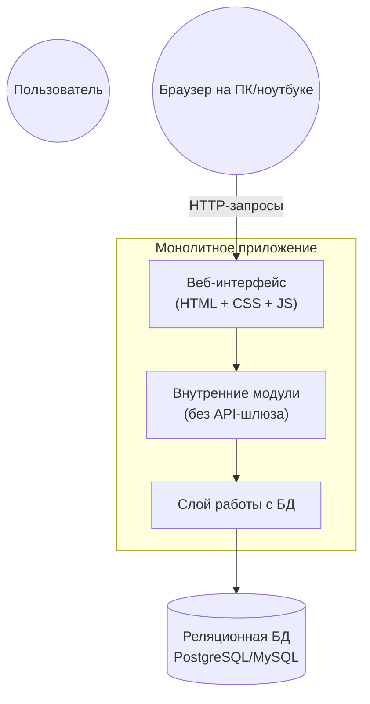

## Архитектура системы

```mermaid
flowchart TD
    User(("Пользователь"))
    User2(("Браузер на ПК/ноутбуке"))

    subgraph Monolith["Монолитное приложение"]
        WebUI["Веб-интерфейс\n(HTML + CSS + JS)"]
        API["Внутренние модули\n(без API-шлюза)"]
        DB_Layer["Слой работы с БД"]
    end

    DB[("Реляционная БД\nPostgreSQL/MySQL")]

    User2 -- "HTTP-запросы" --> WebUI
    WebUI --> API
    API --> DB_Layer
    DB_Layer --> DB
```
